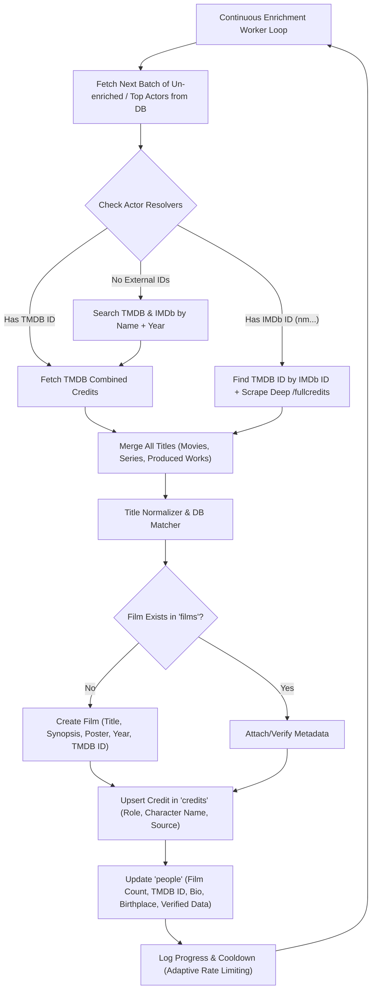

# Technical Implementation Plan: IMDb-Style Actor Media Hub & Continuous Actor Enrichment Engine

This design document outlines the complete architectural specifications, database schemas, frontend component hierarchy, and continuous ingestion pipeline for:
1. **IMDb-Style Dynamic Media Hub** (Showreels, Monologues, Scene Clips, Production Stills, Headshots with conditional rendering).
2. **Indefinite Continuous Actor Enrichment Worker** (Automated full-scale filmography ingestion across TMDB and IMDb).

---

## Part 1: IMDb-Style Actor Media Hub (Photos & Videos)

### 1.1 Objectives & UX Principles
- **Strict Conditional Rendering**: If an actor has uploaded or linked media, display rich, interactive Video & Photo showcase carousels/grids. If an actor has **zero** media, the sections collapse seamlessly with **zero UI gaps, placeholder boxes, or empty states**.
- **Context-Aware Scene Tagging**: Scene clips and production stills can be tagged directly to a specific movie in MuviDB (`film_id`), featuring character names, co-stars, and director credits.
- **Dual Storage & Ingestion Model**:
  - **Cloudflare R2 Direct Uploads**: For exclusive monologue tapes, raw MP4 demo reels, and high-res headshots/stills.
  - **YouTube & Vimeo Embeds**: For public trailers, talk show interviews, festival clips, and official studio excerpts.
- **Interactive Lightbox & Player**:
  - **Video Player**: Theater-mode player with playback speed, full metadata, and quick film link.
  - **Photo Lightbox**: Swipeable full-screen viewer with zoom, photographer credits, and film tags.

---

### 1.2 Database Architecture (`person_media`)

```sql
-- Create Enum Types for Media Classification
CREATE TYPE public.person_media_type AS ENUM ('photo', 'video');
CREATE TYPE public.person_media_category AS ENUM (
  'showreel',
  'monologue',
  'scene_clip',
  'interview',
  'headshot',
  'production_still',
  'red_carpet',
  'behind_the_scenes'
);
CREATE TYPE public.media_moderation_status AS ENUM ('pending', 'approved', 'rejected');

-- Table: person_media
CREATE TABLE IF NOT EXISTS public.person_media (
  id UUID PRIMARY KEY DEFAULT gen_random_uuid(),
  person_id UUID NOT NULL REFERENCES public.people(id) ON DELETE CASCADE,
  media_type public.person_media_type NOT NULL,
  category public.person_media_category NOT NULL,
  title TEXT NOT NULL,
  description TEXT,
  
  -- Media Sources
  url TEXT NOT NULL,                    -- R2 CDN URL or YouTube/Vimeo watch URL
  thumbnail_url TEXT,                   -- Poster/Thumbnail preview URL
  r2_key TEXT,                          -- Cloudflare R2 storage key (for direct uploads)
  embed_provider TEXT,                  -- 'r2', 'youtube', 'vimeo', 'external'
  embed_id TEXT,                        -- YouTube/Vimeo Video ID
  
  -- Dimensions & Durations
  duration_seconds INTEGER,             -- For videos (e.g. 135 for 2m 15s)
  width INTEGER,
  height INTEGER,
  aspect_ratio TEXT,                    -- '16:9', '9:16', '1:1', '4:3'
  
  -- Context & Credits
  film_id UUID REFERENCES public.films(id) ON DELETE SET NULL,
  character_name TEXT,
  photographer_credit TEXT,
  year INTEGER,
  
  -- Ordering & Pinning
  is_primary BOOLEAN DEFAULT FALSE,     -- Primary hero showreel or primary headshot
  sort_order INTEGER DEFAULT 0,
  
  -- Moderation & Access
  status public.media_moderation_status DEFAULT 'approved',
  uploaded_by UUID REFERENCES auth.users(id) ON DELETE SET NULL,
  created_at TIMESTAMPTZ DEFAULT NOW(),
  updated_at TIMESTAMPTZ DEFAULT NOW()
);

CREATE INDEX idx_person_media_person_type ON public.person_media(person_id, media_type, status, sort_order);
CREATE INDEX idx_person_media_film ON public.person_media(film_id);
```

---

### 1.3 Component Architecture & Visual Layout

```
src/
├── components/
│   ├── person/
│   │   ├── PersonMediaSection.jsx          -- Master container with conditional rendering
│   │   ├── PersonVideosCarousel.jsx        -- Horizontal scrollable video cards (Showreels, Clips)
│   │   ├── PersonPhotosGrid.jsx            -- Filterable photo gallery (Headshots, Stills, Events)
│   │   ├── PersonVideoPlayerModal.jsx      -- Theater-mode video player with film metadata
│   │   ├── PersonPhotoLightboxModal.jsx    -- Fullscreen interactive photo lightbox
│   │   └── AddPersonMediaModal.jsx         -- Upload modal (R2 drag-and-drop or YouTube URL)
```

#### Behavior & States
1. **Zero Media**: `PersonMediaSection` returns `null`. The actor profile transitions seamlessly from Biography & Known For directly to Filmography.
2. **Videos Only**: Renders the "Featured Videos & Showreels" carousel with duration badges and categorized tabs.
3. **Photos Only**: Renders the "Photo Gallery" with filter tags (`All`, `Headshots`, `Production Stills`, `Events`).
4. **Both Present**: Renders both sections in an elegant, IMDb-inspired modern dark layout with brand accents.

---

## Part 2: Indefinite Continuous Actor Enrichment Engine

### 2.1 Architecture & Pipeline Design



---

### 2.2 Key Worker Specifications (`scripts/run_continuous_actor_enrichment.mjs`)

1. **Indefinite Execution Loop (`while (true)`)**:
   - Operates continuously without arbitrary limits.
   - Automatically prioritizes:
     1. High-popularity actors with low film counts (gaps in historical data).
     2. Newly added actors with `source = 'manual'` or `source = 'imdb'`.
     3. Actors missing TMDB / IMDb IDs.
2. **Adaptive Rate-Limiting & Anti-Ban Resilience**:
   - **TMDB API Tier**: 40 req/sec limit handled gracefully via exponential backoff.
   - **IMDb Deep Tier (Firecrawl / ZenRows)**: Dynamically called when TMDB has gaps or for unreleased 2025/2026 festival/indie titles.
   - Inter-actor jitter delay (500ms – 1.5s) to ensure zero IP throttling.
3. **Smart Title Deduplication**:
   - Fuzzy normalizes alternative punctuation (e.g. `Òlòtūré` vs `Oloture`, `L.I.F.E.` vs `LIFE`, `Ada Omo Daddy` vs `Ada Omo Daddy: The Movie`).
   - Prevents duplicate film entries via slug hashing and TMDB ID matching.
4. **Atomic Database Transactions**:
   - Inserts new films with complete metadata.
   - Handles `credits_film_person_role_uidx` conflicts gracefully while updating missing character names.
   - Automatically recalibrates `people.film_count` upon completion.
5. **State Persistence & Resume Capability**:
   - Maintains a checkpoint file (`scripts/data/actor_enrichment_state.json`) recording processed IDs, errors, and throughput metrics so the worker can be paused and resumed anytime.

---

## Part 3: Phased Execution Plan

### Phase 1: Database Migration
- [ ] Create `supabase/migrations/20260901000003_create_person_media_table.sql`.
- [ ] Add RLS policies allowing public reads for approved media, user uploads for claimed profiles, and full admin management.

### Phase 2: Continuous Actor Enrichment Daemon
- [ ] Implement [`scripts/run_continuous_actor_enrichment.mjs`](file:///c:/Users/User/Filmdba/lumi/scripts/run_continuous_actor_enrichment.mjs).
- [ ] Add npm command script `"sync:actors:continuous": "node scripts/run_continuous_actor_enrichment.mjs"` in `package.json`.
- [ ] Validate on sample batch of top Nollywood actors (e.g. Lateef Adedimeji, Bimbo Ademoye, Stan Nze, Sola Sobowale).

### Phase 3: Frontend Media Components & Lightbox
- [ ] Build [`src/components/person/PersonMediaSection.jsx`](file:///c:/Users/User/Filmdba/lumi/src/components/person/PersonMediaSection.jsx).
- [ ] Build [`src/components/person/PersonVideosCarousel.jsx`](file:///c:/Users/User/Filmdba/lumi/src/components/person/PersonVideosCarousel.jsx) & [`src/components/person/PersonPhotosGrid.jsx`](file:///c:/Users/User/Filmdba/lumi/src/components/person/PersonPhotosGrid.jsx).
- [ ] Build [`src/components/person/PersonVideoPlayerModal.jsx`](file:///c:/Users/User/Filmdba/lumi/src/components/person/PersonVideoPlayerModal.jsx) & [`src/components/person/PersonPhotoLightboxModal.jsx`](file:///c:/Users/User/Filmdba/lumi/src/components/person/PersonPhotoLightboxModal.jsx).
- [ ] Integrate into [`src/pages/PersonDetail.jsx`](file:///c:/Users/User/Filmdba/lumi/src/pages/PersonDetail.jsx) with strict conditional rendering.

### Phase 4: Media Upload & Management
- [ ] Build [`src/components/person/AddPersonMediaModal.jsx`](file:///c:/Users/User/Filmdba/lumi/src/components/person/AddPersonMediaModal.jsx) with R2 presigned upload + YouTube URL parser.
- [ ] Connect media management into [`src/pages/ProDashboard.jsx`](file:///c:/Users/User/Filmdba/lumi/src/pages/ProDashboard.jsx) and Admin Person Editor.
