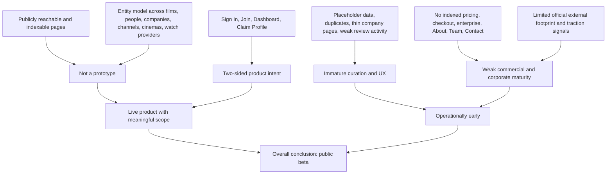

# MuviDB Product and Production-Stage Assessment

## Executive Summary

MuviDB presents itself as an Africa-focused entertainment discovery database, with especially strong emphasis on Nollywood. Its public pages show a structured content model covering films, people, companies, channels, watch-provider hubs, and cinema listings. The clearest product promise is consumer discovery: helping users find what to watch on providers such as Showmax, Kava, YouTube, and in cinemas, while also exposing talent and company pages and a “Claim Profile” path for filmmakers and talent. The site explicitly brands itself as “The Ultimate African Film & Entertainment Database”, “the premier film database for Nollywood”, and “the home of Nollywood”. citeturn1view0turn47search0turn31view1turn30view3

My overall estimate is that MuviDB is at a **public beta** stage, with some early-v1 characteristics. It is clearly beyond a prototype because it is publicly reachable, indexable, has multiple entity types and route families, and exposes public navigation for sign-in, joining, dashboards, and profile claiming. At the same time, a number of signals point away from a mature launch: sparse company pages, placeholder data such as a cinema in “Unknown”, duplicated cast entries, highly inconsistent metadata quality, no visible pricing or monetisation pages, no retrievable About/Team/Contact pages from indexed search results, and weak external company/traction signals. citeturn32search2turn32search3turn46search0turn48view2turn34search0turn35search0

A concise dimension-by-dimension view is below.

| Dimension | Assessment | Confidence |
|---|---|---|
| Product description and core features | African and Nollywood-focused film database with film, people, company, channel, watch-provider, and cinema/showtimes surfaces. citeturn47search0turn31view1turn30view1turn30view2turn30view3turn48view0turn55view0 | High |
| Target users and use cases | Consumer discovery first, with secondary creator/talent participation via sign-in, join, dashboard, and claim-profile flows. citeturn32search2turn32search3turn31view1turn30view2 | Medium |
| Value proposition and differentiation | Differentiated by local market focus on Nollywood/African cinema and by mapping films to YouTube channels, streaming providers, and cinemas. citeturn31view1turn30view0turn48view0turn45news41 | Medium |
| UX completeness | Broad information architecture exists, but content quality is inconsistent and some pages look thin or incomplete. citeturn32search2turn6search2turn46search0turn48view2turn55view0 | High |
| Technical stack and integrations | Public evidence supports a structured, crawlable web app with entity routes; specific framework, hosting, headers, analytics, and payment integrations are largely unspecified from available evidence. citeturn30view1turn30view2turn30view3turn55view0turn19search0turn19search2turn42search0 | Low |
| Business signals | Early signs of a two-sided product, but no surfaced pricing, trial, checkout, or enterprise sales pages. citeturn32search2turn32search3turn34search0 | High |
| Team and company info | Official company identity is weakly surfaced; no indexed About, Team, or Contact pages were found. citeturn35search0 | High |
| Market positioning and competitors | MuviDB sits between IMDb/TMDb-style databases, JustWatch-style watch availability, and local Nollywood-specific products such as NollyData, NollyMeter, NMDb, and FilmFlux. citeturn37search4turn37search14turn45search1turn45search0turn45search7turn54search8 | Medium |
| Traction signals | Public traction evidence is limited: I found no strong press, jobs, funding, or official company presence; indexation exists, but external proof of adoption is weak. citeturn51search1turn36search1turn40search0turn38search0 | Medium |
| Security, privacy and legal | Footer links imply Terms and Privacy exist, but dedicated legal pages were not retrievable through indexed search results; data-handling detail is therefore largely unspecified. citeturn32search1turn32search2turn16search0 | Medium |

## Product Surface and Core Workflows

MuviDB’s public surface is richer than a simple landing page. The indexed page set shows at least six distinct object types and workflows:

- **Watch-provider hubs** such as `https://muvidb.com/watch/showmax`, `https://muvidb.com/watch/cinema`, and `https://muvidb.com/watch/kava`, all framed around “Where to Watch Nollywood”. citeturn31view1turn30view0turn44search5  
- **Film detail pages** such as `https://muvidb.com/films/blood-and-justice-pt-3-5` and `https://muvidb.com/films/just-not-married`, with titles, synopsis text, genres, runtime, cast/crew, and watch links. citeturn30view1turn56view0  
- **People pages** such as `https://muvidb.com/people/frank-paladini`, with role, nationality, short bio, and “Known For”. citeturn30view3  
- **Company pages** such as `https://muvidb.com/companies/amazon-studios`. citeturn55view0  
- **Channel pages** such as `https://muvidb.com/channels/black-movies-tv`, which suggests MuviDB indexes YouTube-like Nollywood distribution channels as first-class entities. citeturn48view0  
- **Cinema pages** such as `https://muvidb.com/cinemas/dca6c90c-a5da-4388-b37c-84e9ff014cac` for Viva Cinemas Ikeja and `https://muvidb.com/cinemas/ff1c2c0b-1231-460b-bfa1-e7b917d02f4c` for Mega 1 Cinema. citeturn30view2turn46search0

The navigation visible in indexed snippets is also broad. Multiple pages expose a top-level structure including **Home, Browse Movies, Top Rated, New Releases, People**, and elsewhere **Showtimes, Cinemas, Channels, People, Companies, Home, Browse, Search, More**. Sign-in and participation actions are present too: **Sign In, Join MuviDB, Dashboard, Claim Profile (For Filmmakers & Talent)**. This is a meaningful amount of product surface for a live database product. citeturn47search0turn6search2turn32search2turn32search3

The product description is internally consistent across pages. MuviDB is described as “the premier film database for Nollywood”, “the home of Nollywood”, and “The Ultimate African Film & Entertainment Database”. That consistent positioning is one of the strongest signs that the team has a real product thesis rather than a one-off content site. citeturn1view0turn31view1turn47search0

The main end-user flow appears to be: discover a title or person, view basic metadata, then jump out to a destination such as YouTube, Showmax, Kava, or cinema showtimes. For example, `https://muvidb.com/watch/showmax` is explicitly framed as a place to “find what to watch tonight”, while film pages such as `https://muvidb.com/films/blood-and-justice-pt-3-5` end in a “Where to Watch” block that points to YouTube. citeturn31view1turn30view1

The UX is broad but not consistently polished. Some pages are thin. `https://muvidb.com/companies/amazon-studios` resolves to little more than a heading in indexed content, and the cinema page for Mega 1 Cinema exposes “Unknown” as the location. citeturn55view0turn46search0

There are also quality-control issues. One page on a site branded as a Nollywood database, `https://muvidb.com/films/just-kidding-movie`, contains what looks like a US tour documentary synopsis rather than clearly Nollywood-specific content, and its cast list includes a duplicated “Ben Turok” entry in the indexed output. Another page, `https://muvidb.com/films/beautiful-movie-that-will-teach-you-a-valuable-life-lesson-today`, shows very thin descriptive text and “User Reviews. 0 User Reviews.” All of that points to ingestion or moderation systems that are still immature. citeturn48view2turn47search4turn47search1turn48view1

A final UX observation is that MuviDB already has the beginnings of social or community features, but they do not look active yet. Indexed snippets include “Be the first to rate” and “0 User Reviews”, which suggests rating/review scaffolding exists, but not meaningful engagement yet. citeturn47search4turn47search1

## Users, Value Proposition and Competition

The most likely primary user is a **viewer deciding what Nollywood or African title to watch and where to watch it**. The copy on watch-provider pages is explicit about that. `https://muvidb.com/watch/showmax` and `https://muvidb.com/watch/cinema` both promise that users can “find what to watch tonight”. citeturn31view1turn30view0

A second user group is **filmmakers, actors, producers, and channels** who want discoverability and profile ownership. That inference comes from the persistent presence of **Claim Profile (For Filmmakers & Talent)** plus entity pages for people, companies, and channels. citeturn32search2turn30view3turn55view0turn48view0

A third user group is likely **industry researchers, talent scouts, and cinema-goers**. Cinema pages promise showtimes, screens, and tickets; older film pages include cast and crew lists; people pages have “Known For”; and company pages exist even if some are still sparse. citeturn46search2turn56view0turn30view3turn55view0

The clearest value proposition is that MuviDB tries to combine several layers that are usually fragmented in the Nigerian film ecosystem: title discovery, person/company credits, provider availability, YouTube channel indexing, and cinema showtimes. That addresses a real market need. Nollywood is large, and WIPO notes output of roughly 1,500 films per year, while more recent reporting describes distribution fragmentation and a strong pivot by Nigerian filmmakers towards YouTube as global streamers pull back. In that environment, a discovery-and-routing layer can be useful. citeturn44search21turn45news41

MuviDB’s strongest differentiation is therefore **local specificity**, not feature novelty. Global platforms already cover adjacent jobs: IMDb positions itself as a searchable database for movies, shows, and people; JustWatch positions itself as a streaming guide; Letterboxd focuses on social film discovery. MuviDB is trying to do a narrower, regional version of those jobs for African and especially Nigerian cinema. citeturn37search4turn37search14turn37search7

That positioning also puts MuviDB directly against local and regional competitors that already articulate a Nollywood-first proposition more completely. NollyData describes itself as “the first Nollywood database” and highlights cast-and-crew search, movie details, and watch information; NollyMeter calls itself a dedicated Nollywood data repository focused on documenting, reviewing, and rating films; NMDb positions itself on LinkedIn as Nigeria’s “most popular and authoritative” source for Nigerian movie and celebrity content; and FilmFlux describes itself as bringing African and Nollywood cinema into one place, with discoverability, creator tools, and article content. citeturn45search1turn45search0turn45search7turn54search8

Against those products, MuviDB currently looks differentiated by **breadth of entity model and localisation of “where to watch”** rather than by stronger curation or stronger creator tooling. FilmFlux, for example, already surfaces promotional tooling, creator FAQs, legal pages, app badges, sign-in methods, and concrete usage metrics such as views. MuviDB does not currently expose a comparably mature operating layer in indexed public evidence. citeturn54search10turn54search16turn54search1turn54search2turn54search3turn54search9

## Technical Architecture and Business Signals

The route design strongly suggests a structured database-backed application. Publicly visible routes include slug-based paths such as `https://muvidb.com/films/blood-and-justice-pt-3-5`, `https://muvidb.com/people/frank-paladini`, `https://muvidb.com/companies/amazon-studios`, `https://muvidb.com/channels/black-movies-tv`, and provider/cinema paths such as `https://muvidb.com/watch/showmax` and `https://muvidb.com/cinemas/dca6c90c-a5da-4388-b37c-84e9ff014cac`. That is consistent with a relational entity graph rather than a flat blog or CMS-only site. citeturn30view1turn30view3turn55view0turn48view0turn31view1turn30view2

The fact that these pages are individually indexable and return structured snippets also implies that MuviDB is at least crawlable and probably server-rendered or pre-rendered in some way. That is a low-confidence technical inference, but it is supported by the search engine’s ability to index and excerpt individual dynamic content pages. citeturn30view1turn30view2turn30view3turn48view0turn56view0

What I could **not** robustly verify from available public evidence is the concrete technical stack: framework, JS libraries, analytics tags, response headers, CDN, hosting provider, payments infrastructure, or observability tooling. Searches for public tech-detection artefacts did not surface MuviDB-specific BuiltWith or urlscan results; instead they surfaced generic tool homepages or no results. For that reason, framework, hosting, and analytics should be treated as **unspecified** rather than guessed. citeturn19search0turn19search2turn42search0

From a business-model perspective, the product shows signs of a **two-sided design**, but not a monetisation layer that is visible yet. Evidence for the supply side includes “Claim Profile (For Filmmakers & Talent)”, “Dashboard”, “Join MuviDB”, and entity pages for channels, companies, and people. Evidence for the demand side includes watch-provider hubs and cinema pages. citeturn32search2turn32search3turn48view0turn30view2

What is missing is equally important. I could not surface indexed pages for pricing, subscriptions, payment, free trial, checkout, or enterprise sales. That sharply lowers confidence that MuviDB has moved into a commercially mature operating phase. It may have internal plans or private flows, but from public evidence those are unspecified. citeturn34search0

A subtle but important business signal is the data source pattern visible on many film pages. A large share of title descriptions appear to be pulled from YouTube upload text, often including subscription prompts, hashtags, and channel boilerplate. That suggests MuviDB may currently be aggregating and normalising existing distribution metadata rather than originating a deeply curated editorial corpus. As an early strategy, that is sensible. As a sign of maturity, it points to an ingestion-heavy product that still needs stronger moderation and enrichment. citeturn30view1turn46search1turn46search3turn46search4turn51search0

## Team, Company and Traction

Public company identity is one of MuviDB’s weakest areas. I found **no indexed About, Team, or Contact pages** on MuviDB itself. That does not prove they do not exist, but it does mean they were not discoverable through public search on the review date. citeturn35search0

I also could not confidently identify founders or a legal entity from official MuviDB sources. Searches for MuviDB and founder/company information surfaced either unrelated results or ambiguous third-party profiles, including a LinkedIn profile for “muvidb Database” associated with Softlinkweb that is not sufficient evidence to attribute ownership of the current product. As a result, founder and legal-company details should be treated as **unspecified**. citeturn36search1turn50search1

Externally, MuviDB appears to have very little visible traction signalling compared with stronger category peers. I found no obvious job listings, no strong funding footprint, no clear official LinkedIn company profile, and no clearly attributable press coverage. The domain string does appear in historical deleted-domain lists from 2016 and 2017, which suggests the name has circulated for years, but that is not evidence of current operating tenure or traction. citeturn40search0turn36search0turn18search4

The strongest traction signal MuviDB does have is **search indexation itself**. The search engine returns many entity pages, including recent 2026 film pages, older 2016 and 2024 titles, and a spread of people, channels, cinemas, and companies. That means MuviDB is not invisible. However, indexation is not the same as user adoption. citeturn30view1turn56view0turn46search4turn48view0turn30view3

In contrast, several competitors show stronger public-operating signals. NollyData has an identifiable founder in an external interview, explicit community sign-up, and a clearer “About” narrative. NollyMeter exposes registration, about, and account flows publicly. FilmFlux exposes app-store badges, newsletter prompts, creator FAQs, promotion pages, legal pages, and content-level view counts in the millions. Those are all signals of more advanced go-to-market and operational maturity than what I could verify for MuviDB. citeturn45search9turn45search5turn45search11turn54search1turn54search10turn54search16turn54search9turn54search11

## Security, Privacy and Legal Posture

MuviDB’s indexed public snippets repeatedly show footer links for **Terms** and **Privacy**, usually collapsed into the text string “TermsPrivacy”. That is encouraging in the sense that legal pages are probably intended to exist. citeturn32search1turn32search2turn32search3

However, searches for dedicated privacy, terms, legal, about, and contact pages did not return MuviDB-specific results. That means I could not inspect the contents of the privacy policy, terms, cookie disclosures, data-retention language, security statements, jurisdiction, or contact addresses. Accordingly, MuviDB’s concrete legal and privacy posture is mostly **unspecified** from the evidence available here. citeturn16search0turn35search0

The presence of **Sign In** and **Join MuviDB** indicates the product likely collects at least standard account data. But without the policy text, it is not possible to verify how MuviDB handles email addresses, passwords, social sign-on, cookies, analytics, user reviews, or profile-claim data. citeturn32search2turn32search3

This matters because mature peers make these basics legible. FilmFlux’s public footprint includes retrievable Terms and Privacy pages, and its privacy page explicitly states what personal data it receives on Google and Apple sign-in. MuviDB is not yet showing that same level of public compliance clarity. citeturn54search2turn54search3

My practical reading is that MuviDB’s security and legal posture may not be absent, but it is **not transparently surfaced enough** for a mature public-facing media platform. That is a classic public-beta signal. citeturn32search1turn16search0turn54search2turn54search3

## Stage Assessment, Evidence Map and Founder Questions

The balance of evidence supports a **public beta** judgement.

On the “more mature” side, MuviDB already has a sizeable public surface area, indexable page templates, multiple route families, a coherent brand thesis, local-market focus, and visible account/profile scaffolding. On the “earlier-stage” side, the curation layer is uneven, legal/company transparency is weak, monetisation is not externally legible, and external traction signals are light. citeturn47search0turn32search2turn46search0turn48view2turn34search0turn35search0

| Signals supporting early-stage assessment | Signals supporting mature-stage assessment |
|---|---|
| Placeholder or missing data such as `Mega 1 Cinema` in `Unknown`. citeturn46search0 | Publicly accessible and search-indexed across many routes. citeturn30view1turn30view2turn30view3turn48view0 |
| Inconsistent metadata quality, keyword-stuffed descriptions, and YouTube boilerplate copied into movie pages. citeturn46search1turn46search3turn46search4turn51search0 | Clear information architecture: films, people, companies, channels, cinemas, watch providers. citeturn30view1turn30view2turn30view3turn55view0turn48view0 |
| Off-domain or weakly moderated content, plus duplicate cast entries. citeturn48view2 | Consumer-facing “where to watch” value is already implemented. citeturn31view1turn30view0 |
| No surfaced pricing, trial, payment, or enterprise pages. citeturn34search0 | Supply-side scaffolding exists: Sign In, Join, Dashboard, Claim Profile. citeturn32search2turn32search3 |
| No indexed About, Team, or Contact pages. citeturn35search0 | Consistent product positioning around African/Nollywood discovery. citeturn1view0turn47search0 |
| No strong public evidence of jobs, funding, or official company footprint. citeturn40search0turn36search1 | Some older titles and newer 2026 titles are both present, implying active ingestion over time. citeturn56view0turn30view1turn46search3 |

The most important next investigative steps would be to verify what public search could not settle: direct inspection of the live sign-up flow, the actual content of Terms and Privacy pages, response headers and analytics tags in-browser, sitemaps/robots, any hidden pricing or partner pages, and whether “Claim Profile” leads to a self-serve verification workflow or only a placeholder funnel. Those checks would materially raise or lower the confidence of this stage estimate. citeturn32search2turn32search3turn16search0

The most useful founder questions would be these:

- What is the canonical company/legal entity behind MuviDB, and who are the founders and operators?
- Is MuviDB primarily a consumer discovery product, a B2B discovery layer for filmmakers and talent, or both?
- Which data sources are editorially curated versus programmatically ingested from YouTube channels, cinemas, or third parties?
- What does “Claim Profile” actually unlock today: verified bios, outbound contact, analytics, promotion, or payment products?
- What is the intended monetisation path: profile subscriptions, promoted listings, advertising, affiliate revenue, ticketing, or data/API licensing?
- Which parts of the product are fully launched versus still in beta: reviews, ratings, showtimes, tickets, account dashboards, and creator tools?
- Why are company/about/legal pages not strongly surfaced in public indexing, and what privacy/security standards govern user accounts?

### Bottom-line judgement

**Estimated production stage: Public beta.**  
**Rationale:** MuviDB has enough public surface area, crawlable page depth, and coherent category design to be treated as a real launched product. But the combination of incomplete curation, thin public-operating signals, limited legal/company transparency, and absent monetisation evidence makes it look earlier than a fully mature v1 launch. citeturn47search0turn32search2turn46search0turn48view2turn34search0turn35search0